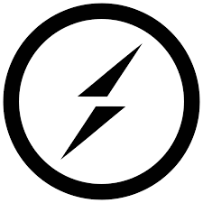

   # Ankur Singh
  

    Full-Stack Developer | Tech Enthusiast | Problem Solver 
    <em>Passionate about turning complex problems into clean, maintainable code</em>
  

### About Me

- Full-stack developer since 2018
- Passionate about crafting scalable backend systems & sleek frontends
- Exploring Web3 & Blockchain integrations
- Focused on writing clean, maintainable code

  
  
### Technologies I'm Working With
  
  
  
  
  
  
  

  
### Technologies I Know
  
  
  
  
  
  
  
  
  
  
  
  
  
  

---

  
  
  

    

<!--   

  

 -->

---

  

